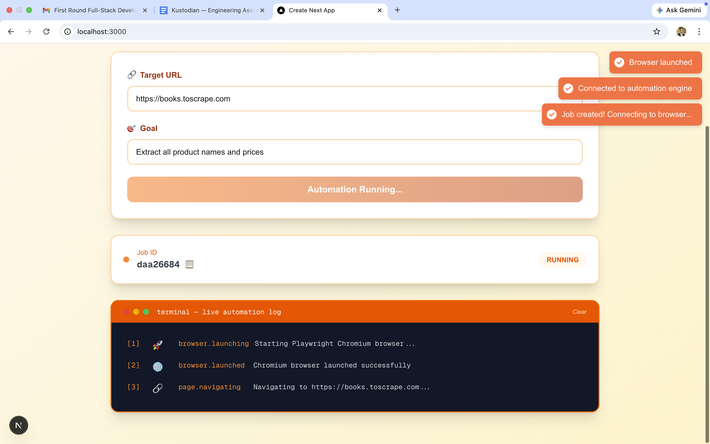
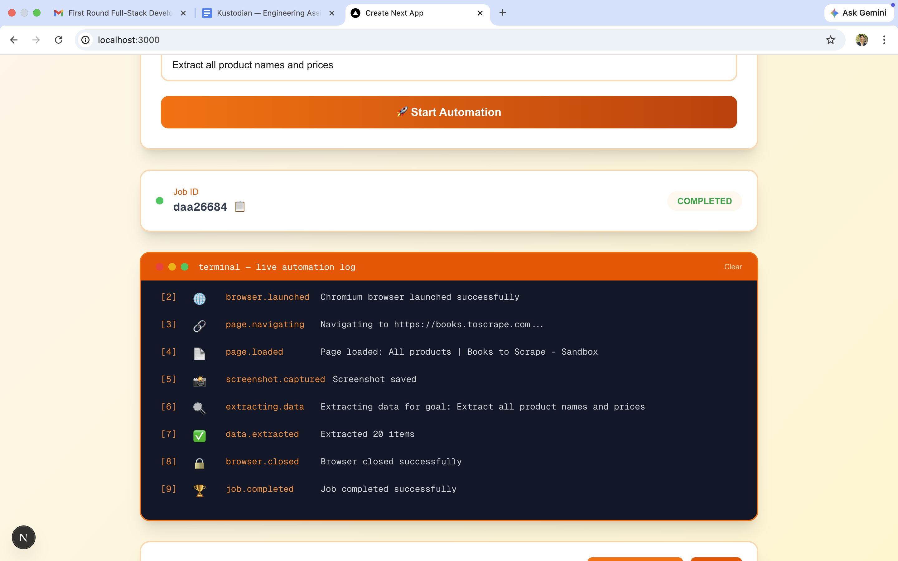
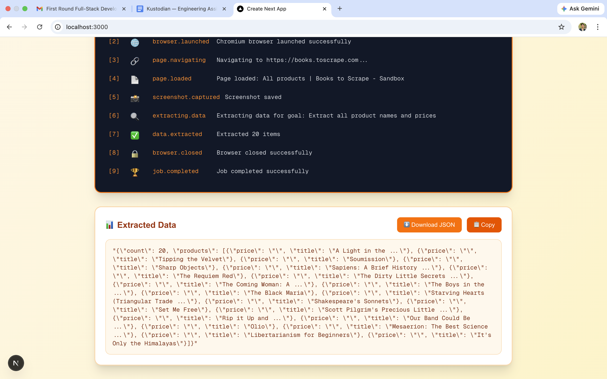

# Browser Automation Job Runner

## Overview
A system where users submit a URL and goal, backend runs Playwright automation, and frontend watches in real-time via WebSocket.

## Tech Stack
- Backend: FastAPI (Python), PostgreSQL, Playwright
- Frontend: Next.js (React, TypeScript), Tailwind CSS

## 🐳 Run with Docker (Preferred)

### Prerequisites
- Docker Desktop installed

### One Command to Run Everything
```bash
docker-compose up --build

This starts:

PostgreSQL on port 5432

Backend API on port 8000

Frontend on port 3000

Access the App
Open http://localhost:3000

Stop Everything

docker-compose down

Run without Docker

cd backend
python -m venv venv
source venv/bin/activate  # Windows: venv\Scripts\activate
pip install -r requirements.txt
playwright install chromium
python main.py

Frontend (Another terminal)

cd frontend
npm install
npm run dev

Usage
Open http://localhost:3000

Enter URL (e.g., https://books.toscrape.com)

Enter goal (e.g., "Extract all product names and prices")

Click "Start Automation"

Watch live logs stream in real-time

Features
✅ 1.Real-time WebSocket event streaming

✅ 2.Playwright browser automation

✅ 3.Screenshot capture

✅ 4.Data extraction

✅ 5.PostgreSQL persistence

✅ 6.Docker support (one-command setup)


## Screenshots

### Home Page


### Live Automation Logs


### Job Completed


### Extracted Data


Author
Ramavath Vamshi

GitHub: Vamshirathod14

Email: vamshinaikramavath@gmail.com

